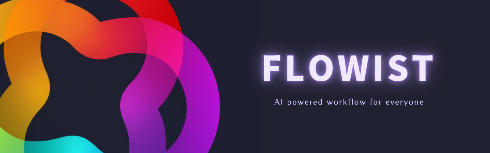

# NeuFlow AI

<p align="center">
  
</p>

[](https://github.com/neuflowai/neuflow/releases)
[](https://github.com/neuflowai/neuflow/blob/main/LICENSE)

- [English](README.md)
- [简体中文](README.zh-CN.md)

NeuFlow is an open source AI-based desktop and web **workflow platform** that also serves as an **model interactive tool** for everyone. Whether you are a beginner or a professional.

Currently, NeuFlow AI integrates with Open AI and Google AI supporting custom endpoints, allowing you to utilize models such as GPT3.4, GPT4, and Gemini Pro. Simply download the platform and fill in your API key to start using it.

## Screenshot

<p align="center">
  
</p>

## Features

NeuFlow AI aims to provide an intuitive and user-friendly interface that enables users to easily create, edit, and customize workflows. You can start with predefined templates or fully customize workflows according to your needs. By dragging and connecting different tasks and operations, you can build complex workflows and automate their execution.

Currently, NeuFlow AI supports the following features:

- **Drag-and-drop interface**: You can easily create workflows by dragging and connecting different tasks and operations.
- **Presets**: You can create and resuse presets for tasks and operations.
- **Widgets**:
  - **ChatBot Widget**: interact with the LLM models use a chatbot interface.
  - **Query Widget**: Simple question and answer widget.

Working on:

- [ ] (WIP) **TTS Widget**: Text to speech widget. Allow you to hear the output of the model.
- [ ] (WIP) **STT Widget**: Speech to text widget. Allow you to input text using your voice.
- [ ] (WIP) **Image Generation Widget**: Generate images using the model.
- And more...

## Future Development

Our platform is continuously developing to offer enhanced scalability. We are planning to integrate more powerful AI capabilities, including natural language processing, computer vision, and machine learning. This means you will be able to interact with NeuFlow AI using natural language commands, enabling faster task completion. You can input text, voice, or image data and interact and explore with the models. This makes NeuFlow AI a powerful tool for various domains, including data analysis, text processing, image recognition, and predictive modeling.

## Getting Started

To get started with NeuFlow AI, follow these steps:

1. Download the NeuFlow AI application.
2. Obtain an API key from Open AI or Google AI.
3. Fill in the API key in the application's settings.
4. Start using NeuFlow AI to create and execute workflows.

## Contribution

Contributions to NeuFlow AI are welcome! If you have any ideas, bug reports, or feature requests, please submit them through our GitHub repository. We appreciate your feedback and collaboration in making NeuFlow AI even better.

If you are interested in developing NeuFlow AI, you can follow the steps below to set up the development environment.

### Setup

```bash
pnpm i
```

### Run

```bash
pnpm dev:web
pnpm dev:electron
```

### Build

```bash
pnpm build:web
pnpm build:electron
```

## License

See [LICENSE](LICENSE) for more information.

## Contact

For any inquiries or further information, please contact our team at [contact@neuflow.net](mailto:contact@neuflow.net). We would be happy to assist you.

Let's unleash the power of AI with NeuFlow AI!
